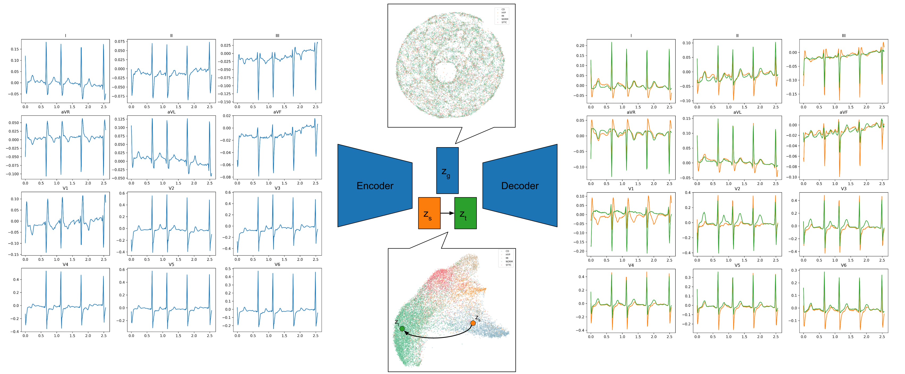

# Counterfactual explanation for multivariate times series using a contrastive variational autoencoder (CVAE)

This repository is the official implementation of *Counterfactual explanation for multivariate times series using a contrastive variational autoencoder*. 




## Requirements

To install requirements:

```setup
pip install -r requirements.txt
```
The dataset used in this project can be downloaded from [PhysioNet](https://physionet.org/content/ptb-xl/1.0.1/#files-panel).
After downloading, please place the *records100* folder, *ptbxl_database.csv*, and *scp_statements.csv* files into the raw_data folder. Then, generate the dataset with the following command:

```setup
python dataset_generation.py
```

## Training

Train the models using the following commands :
```
python train_vae.py <latent_space> <random_seed>
python train_contrastive_vae.py <latent_space> <salient_dim> <random_seed>
python train_contrastive_ae.py <latent_space> <salient_dim> <random_seed>
```

## Evaluation

Evaluate the models with the following command: 

```eval
python eval.py
```

## Results

Visualize the results by running the *result.ipynb* Jupyter notebook.

## Metrics

All the metrics for each model is stored in *df_res.csv*

## Citation

If you use this code in your research, please cite it as:

```bibtex
@inproceedings{todo2023counterfactual,
  title={Counterfactual Explanation for Multivariate Times Series Using A Contrastive Variational Autoencoder},
  author={Todo, William and Selmani, Merwann and Laurent, B{\'e}atrice and Loubes, Jean-Michel},
  booktitle={ICASSP 2023-2023 IEEE International Conference on Acoustics, Speech and Signal Processing (ICASSP)},
  pages={1--5},
  year={2023},
  organization={IEEE}
}
```